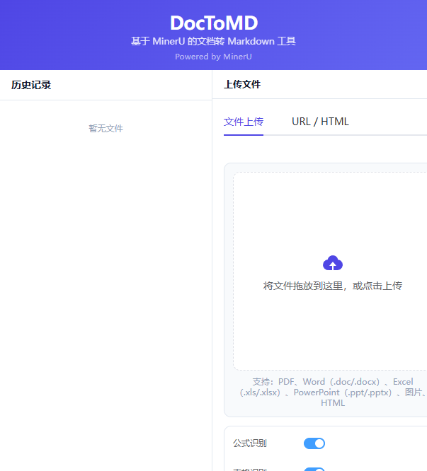
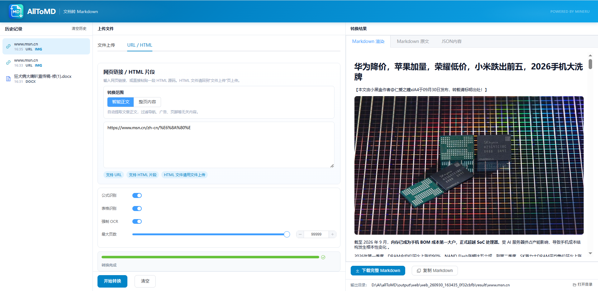
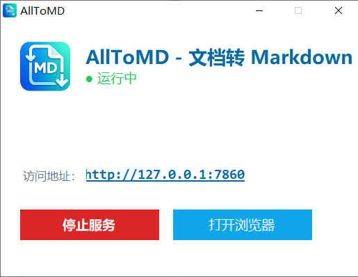

<div align="center">


# AllToMD

### 一站式文档转 Markdown 工具

将 PDF、Word、Excel、PPT、图片、网页链接一键转换为 Markdown，自动提取图片、公式与表格。

基于 [MinerU](https://github.com/opendatalab/MinerU) 引擎，本地运行，数据不出设备。

**[English](README.md)** · **简体中文**

<br/>

[](LICENSE)
[](https://github.com/opendatalab/MinerU)
[](https://vuejs.org/)
[](https://fastapi.tiangolo.com/)
[](https://www.python.org/)
[](https://element-plus.org/)

[功能特性](#-功能特性) · [截图预览](#-截图预览) · [快速开始](#-快速开始) · [架构设计](#-架构设计) · [API 文档](#-api-文档) · [常见问题](#-常见问题)

</div>

<br/>

> ## 下载绿色版
> 
> 无需配置环境，下载解压即可使用：[Releases v1.0.0](https://github.com/kaisooQing/AllToMD/releases/tag/v1.0.0)
> 
> 源码运行请参考下方[快速开始](#-快速开始)。

<br/>

## ✨ 功能特性

<table>
<tr>
<td width="50%">

### 📄 多格式支持

PDF · Word · Excel · PPT · 图片 · HTML

拖拽上传，批量处理，自动识别文件类型

</td>
<td width="50%">

### 🌐 网页链接直转

输入 URL 自动抓取并转为 Markdown

支持 JS 动态渲染页面（SPA、Shadow DOM）

</td>
</tr>
<tr>
<td width="50%">

### 🔬 公式与表格识别

LaTeX 数学公式自动识别

表格结构化提取，保留行列关系

</td>
<td width="50%">

### 🖼️ 图片自动提取

文档图片提取并本地化

Markdown 图片链接重写为本地路径

</td>
</tr>
<tr>
<td width="50%">

### ⚡ 四种解析后端

Pipeline · VLM · Hybrid · Office

按文档类型选择最优策略

</td>
<td width="50%">

### 📊 实时进度追踪

分阶段进度：版面 → 公式 → 表格 → OCR

每页更新，进度平滑无回退

</td>
</tr>
<tr>
<td width="50%">

### 🌍 中英文双语

界面国际化自动检测

支持中文 / English 一键切换

</td>
<td width="50%">

### 🖥️ 三栏布局

左栏历史记录 · 中栏上传 · 右栏预览

Markdown 渲染 / 原文 / JSON 三种视图

</td>
</tr>
</table>

---

## 📸 截图预览

<div align="center">

**主界面**



<br/><br/>

**转换结果**



<br/><br/>

**启动窗口**



</div>

---

## 🚀 快速开始

### 环境要求

| 依赖 | 版本 |
|---|---|
| Python | 3.10+ |
| Node.js | 18+ |
| npm | 9+ |
| CUDA（可选） | 11.8+（GPU 加速推理） |

### 1 · 克隆仓库

```bash
git clone https://github.com/kaisooQing/AllToMD.git
cd AllToMD
```

### 2 · 配置后端环境

```bash
# 创建 conda 虚拟环境
conda create -n alltomd python=3.10
conda activate alltomd

# 安装 MinerU 依赖
cd MinerU
pip install -e ".[core]"

# 安装额外依赖
pip install curl_cffi markdownify httpx
```

<details>
<summary>📖 查看完整依赖列表</summary>

```bash
# core 包含：pipeline + vlm + gradio
# pipeline: PyTorch, torchvision, transformers, onnxruntime
# vlm: torch, transformers, accelerate
# gradio: gradio, gradio-pdf

# 额外依赖（URL/HTML 转换功能）
pip install curl_cffi markdownify httpx

# 可选：S3 存储
pip install -e ".[s3]"

# 可选：vLLM 推理（仅 Linux）
pip install -e ".[vllm]"

# 可选：LMDeploy 推理（仅 Windows）
pip install -e ".[lmdeploy]"
```
</details>

### 3 · 配置前端

```bash
cd ../frontend
npm install
```

### 4 · 安装 Playwright 浏览器

```bash
# 设置浏览器路径（推荐，避免下载到 C 盘）
set PLAYWRIGHT_BROWSERS_PATH=..\ms-playwright

# 安装 Chromium
python -m playwright install chromium
```

### 5 · 启动开发服务

**方式一**：一键启动（Windows）

```
.\启动Web_Dev.bat
```

**方式二**：手动启动

```bash
# 终端 1 — 后端服务（端口 7860）
set MODELSCOPE_CACHE=..\model_cache
set MINERU_MODEL_SOURCE=modelscope
set MINERU_WEB_UI_DIR=..\frontend\dist
python -m mineru.cli.fast_api --port 7860

# 终端 2 — 前端开发服务器（端口 5173）
cd frontend
npm run dev
```

启动后打开 `http://localhost:5173` 即可使用。

> ⚠️ 首次运行时，AI 模型会自动从 ModelScope 下载到 `model_cache/` 目录（约 1 GB），请确保网络通畅。

### 6 · 构建生产版本

```bash
cd frontend
npm run build
```

构建产物输出到 `frontend/dist/`。

---

## 🏗️ 架构设计

```
┌─────────────────────────────────────────────────────┐
│                     用户输入                          │
│            文件 / URL / HTML 片段                     │
└──────────────────────┬──────────────────────────────┘
                       │
                       ▼
┌─────────────────────────────────────────────────────┐
│              Vue 3 前端 (Element Plus)               │
│                                                     │
│   历史记录  │  上传面板  │  结果预览  │  高级选项     │
│   Pinia    │  拖拽上传  │  Markdown  │  i18n       │
└──────────────────────┬──────────────────────────────┘
                       │  REST API
                       ▼
┌─────────────────────────────────────────────────────┐
│           FastAPI 后端 (端口 7860)                   │
│                                                     │
│   任务队列  │  进度回调  │  超时管理  │  结果打包     │
└──────┬─────────────┬────────────────────────────────┘
       │             │
       ▼             ▼
┌──────────────┐   ┌──────────────────────────────────┐
│  MinerU 引擎 │   │       URL/HTML 转换路径            │
│              │   │                                  │
│ ┌──────────┐ │   │  curl_cffi (TLS 指纹模拟)         │
│ │ Pipeline │ │   │       ↓                          │
│ │ 版面→公式 │ │   │  Playwright (JS 渲染回退)        │
│ │ →表格→OCR│ │   │       ↓                          │
│ └──────────┘ │   │  正文提取 + 噪声清理              │
│ ┌──────────┐ │   │       ↓                          │
│ │   VLM    │ │   │  HTML → Markdown (markdownify)   │
│ │ 视觉模型  │ │   │       ↓                          │
│ └──────────┘ │   │  图片并发下载 + 本地化            │
│ ┌──────────┐ │   └──────────────────────────────────┘
│ │  Hybrid  │ │
│ │ 混合模式  │ │
│ └──────────┘ │
│ ┌──────────┐ │
│ │  Office  │ │
│ │ 文档专用  │ │
│ └──────────┘ │
└──────────────┘
       │
       ▼
┌─────────────────────────────────────────────────────┐
│                     输出结果                         │
│          .md 文件 + images/ 目录 + .zip 包           │
└─────────────────────────────────────────────────────┘
```

### 解析后端对比

| 后端 | 原理 | 速度 | 质量 | 适用场景 |
|---|---|---|---|---|
| `pipeline` | 流水线：版面分析 → 公式 → 表格 → OCR | ⚡ 快 | ⭐⭐⭐ | 通用文档 |
| `vlm` | 视觉语言模型直接推理 | 🐢 慢 | ⭐⭐⭐⭐⭐ | 复杂版面、学术论文 |
| `hybrid` | Pipeline + VLM 混合 | 🐢 慢 | ⭐⭐⭐⭐ | 兼顾速度与质量 |
| `office` | Office 文档专用解析 | ⚡ 快 | ⭐⭐⭐ | .docx / .xlsx / .pptx |

---

## 📁 项目结构

```
AllToMD/
├── frontend/                     # Vue 3 前端
│   ├── src/
│   │   ├── components/
│   │   │   ├── AppHeader.vue          # 顶部标题栏
│   │   │   ├── HistoryPanel.vue       # 左栏 · 历史记录
│   │   │   ├── UploadPanel.vue        # 中栏 · 上传与转换
│   │   │   ├── ResultPanel.vue        # 右栏 · 结果预览
│   │   │   └── AdvancedOptions.vue    # 高级选项折叠面板
│   │   ├── stores/app.js              # Pinia 全局状态
│   │   ├── api/mineru.js              # 后端 API 封装
│   │   ├── i18n/index.js              # 中英文国际化
│   │   └── utils/                     # 工具函数
│   ├── package.json
│   └── vite.config.js
│
├── MinerU/                        # MinerU 引擎 (基于 v3.4.4)
│   ├── mineru/
│   │   ├── cli/
│   │   │   ├── fast_api.py            # FastAPI 主应用
│   │   │   ├── web_api.py             # URL/HTML 转换 API
│   │   │   └── client.py              # CLI 客户端
│   │   ├── backend/
│   │   │   ├── pipeline/              # 流水线后端
│   │   │   ├── vlm/                   # VLM 后端
│   │   │   ├── hybrid/               # 混合后端
│   │   │   └── office/               # Office 文档后端
│   │   └── model/                     # AI 模型定义
│   ├── pyproject.toml
│   └── LICENSE.md
│
├── 启动Web_Dev.bat                # 开发模式启动脚本
├── AllToMD使用说明/               # 用户手册
├── logo.png / logo.ico            # 项目 Logo
├── LICENSE                        # Apache 2.0
└── README.md
```

---

## 📡 API 文档

### 文件转换

| 方法 | 路径 | 说明 |
|---|---|---|
| `POST` | `/tasks` | 提交文件转换任务 |
| `GET` | `/tasks/{task_id}` | 查询任务状态与进度 |
| `GET` | `/tasks/{task_id}/result` | 下载转换结果（ZIP） |
| `DELETE` | `/tasks/{task_id}` | 取消任务 |

<details>
<summary>📖 请求参数</summary>

| 参数 | 类型 | 说明 |
|---|---|---|
| `files` | File[] | 上传的文件 |
| `lang_list` | String[] | OCR 语言（`ch`、`en`） |
| `backend` | String | 后端类型：`pipeline` / `vlm` / `hybrid` |
| `effort` | String | Hybrid 强度：`low` / `medium` / `high` |
| `parse_method` | String | 解析方式：`auto` / `ocr` / `txt` |
| `formula_enable` | String | 公式识别开关 |
| `table_enable` | String | 表格识别开关 |
| `image_analysis` | String | 图片分析开关 |
| `start_page_id` | String | 起始页 |
| `end_page_id` | String | 结束页 |
</details>

### URL/HTML 转换

| 方法 | 路径 | 说明 |
|---|---|---|
| `GET` | `/api/config` | 获取前端配置 |
| `POST` | `/api/convert/url_html` | URL/HTML 转换 |
| `GET` | `/api/download/{task_id}` | 下载转换结果 |

---

## ⚙️ 配置

### 关键环境变量

| 变量 | 默认值 | 说明 |
|---|---|---|
| `MODELSCOPE_CACHE` | `model_cache/` | AI 模型缓存目录 |
| `MINERU_MODEL_SOURCE` | `modelscope` | 模型下载源 |
| `MINERU_WEB_UI_DIR` | `frontend/dist` | 前端静态文件目录 |
| `PLAYWRIGHT_BROWSERS_PATH` | `ms-playwright/` | Playwright 浏览器路径 |

### 超时配置

| 场景 | 策略 |
|---|---|
| 文件上传 | 基础 2 分钟 + 每 10MB 加 1 分钟，上限 10 分钟 |
| 转换轮询 | 每页 30 秒，最少 15 分钟，最多 120 分钟 |
| URL/HTML 转换 | 固定 2 分钟 |
| API 默认超时 | 30 秒 |

---

## ❓ 常见问题

<details>
<summary><b>首次启动很慢 / 一直在下载</b></summary>

首次运行时，AI 模型（OCR、版面分析、公式识别等）会自动从 ModelScope 下载到 `model_cache/` 目录，大小约 1 GB。请确保网络通畅，下载完成后后续启动会直接加载本地缓存。
</details>

<details>
<summary><b>端口 7860 被占用</b></summary>

启动脚本会检测端口 7860 是否被占用。如果已占用，请先关闭占用端口的进程，或修改 `启动Web_Dev.bat` 中的端口号。

```bash
# 查看占用端口的进程
netstat -ano | findstr :7860
```
</details>

<details>
<summary><b>Playwright 启动失败</b></summary>

确保已安装 Chromium 浏览器并正确设置了 `PLAYWRIGHT_BROWSERS_PATH` 环境变量：

```bash
set PLAYWRIGHT_BROWSERS_PATH=..\ms-playwright
python -m playwright install chromium
```

部分网站有反爬检测，Playwright 可能被拦截。建议在浏览器中手动保存 HTML 后上传。
</details>

<details>
<summary><b>GPU 推理不生效 / 速度慢</b></summary>

1. 确认已安装 CUDA 驱动（11.8+）
2. 安装 GPU 版 PyTorch：
   ```bash
   pip install torch torchvision --index-url https://download.pytorch.org/whl/cu118
   ```
3. 确认 GPU 可用：`python -c "import torch; print(torch.cuda.is_available())"`
</details>

<details>
<summary><b>模型缓存下载到 C 盘了</b></summary>

确保在启动前设置环境变量，将缓存重定向到项目目录：

```bash
set MODELSCOPE_CACHE=..\model_cache
```

如果已经下载到 C 盘，可以将 `.cache/modelscope` 目录移动到 `model_cache/` 下。
</details>

---

## 🗺️ 路线图

- [x] 文件格式支持（PDF / Word / Excel / PPT / 图片 / HTML）
- [x] URL 网页链接直接转换
- [x] 四种解析后端（Pipeline / VLM / Hybrid / Office）
- [x] 中英文双语界面
- [x] 历史记录管理
- [x] 实时进度追踪
- [ ] Docker 一键部署
- [ ] 批量文件队列
- [ ] Markdown 编辑与导出
- [ ] 更多 OCR 语言支持
- [ ] 插件系统

---

## 🤝 贡献

欢迎提交 Issue 和 Pull Request！

1. Fork 本仓库
2. 创建特性分支：`git checkout -b feature/your-feature`
3. 提交更改：`git commit -m 'feat: add some feature'`
4. 推送分支：`git push origin feature/your-feature`
5. 提交 Pull Request

### 开发约定

- 前端修改后构建：`cd frontend && npm run build`
- 后端修改后重启 FastAPI 服务
- 提交信息使用 Conventional Commits 格式

---

## 📄 许可证

本项目采用 **Apache License 2.0** — 见 [LICENSE](LICENSE)。

项目基于 [MinerU](https://github.com/opendatalab/MinerU) v3.4.4 开发，MinerU 同样采用 Apache License 2.0（含附加条款）— 见 [MinerU/LICENSE.md](MinerU/LICENSE.md)。

## 🙏 致谢

- **[MinerU](https://github.com/opendatalab/MinerU)** — 文档解析引擎，由 OpenDataLab 开发
- **[Vue.js](https://vuejs.org/)** — 渐进式 JavaScript 框架
- **[Element Plus](https://element-plus.org/)** — Vue 3 UI 组件库
- **[FastAPI](https://fastapi.tiangolo.com/)** — 现代、高性能的 Python Web 框架
- **[PyTorch](https://pytorch.org/)** — 深度学习框架

---

<div align="center">

**如果这个项目对你有帮助，请点个 ⭐ Star 支持一下！**

<br/>

<sub>by <a href="https://github.com/kaisooQing">王小氢</a></sub>

</div>
